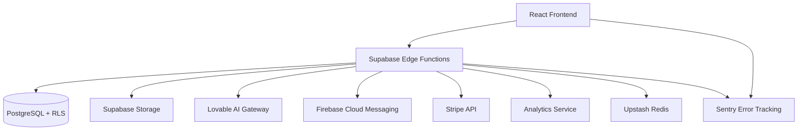

# Design Document

## Overview

This design covers the implementation of the remaining MVP features for Respira Livre: AI Coach, Push Notifications, Squads, In-App Purchases, Content Management, Analytics, and Production Configuration. The design leverages existing Supabase infrastructure, Lovable AI, Firebase Cloud Messaging, and Stripe for payments.

## Architecture

### System Components



### Data Flow Patterns

1. **AI Coach**: Frontend → ai-coach Edge Function → Lovable AI → Stream Response → Frontend
2. **Push Notifications**: Cron Trigger → send-notification Edge Function → FCM → User Device
3. **Squads**: Frontend → Supabase Realtime → All Squad Members
4. **IAP**: Frontend → create-payment → Stripe Checkout → webhook-stripe → Database
5. **Analytics**: Frontend/Backend → track-event → Analytics Service

## Components and Interfaces

### 1. AI Coach System

#### Database Schema

```sql
CREATE TABLE chat_messages (
  id UUID PRIMARY KEY DEFAULT gen_random_uuid(),
  user_id UUID REFERENCES auth.users NOT NULL,
  role TEXT CHECK (role IN ('user', 'assistant')) NOT NULL,
  content TEXT NOT NULL,
  created_at TIMESTAMPTZ DEFAULT NOW()
);

CREATE INDEX idx_chat_messages_user_created ON chat_messages(user_id, created_at DESC);

-- RLS Policies
ALTER TABLE chat_messages ENABLE ROW LEVEL SECURITY;

CREATE POLICY "Users can view own messages"
  ON chat_messages FOR SELECT
  USING (auth.uid() = user_id);

CREATE POLICY "Users can insert own messages"
  ON chat_messages FOR INSERT
  WITH CHECK (auth.uid() = user_id AND role = 'user');
```

#### Edge Function: ai-coach

```typescript
// supabase/functions/ai-coach/index.ts
interface AICoachRequest {
  message: string;
  includeContext: boolean;
}

interface AICoachResponse {
  stream: ReadableStream;
}
```

**Implementation Details:**
- Use Lovable AI endpoint with LOVABLE_API_KEY from environment
- Fetch user profile and progress data for context
- System prompt: "You are a supportive smoking cessation coach..."
- Stream responses using Server-Sent Events
- Store both user message and AI response in chat_messages table

### 2. Push Notifications System

#### Database Schema

```sql
CREATE TABLE user_tokens (
  id UUID PRIMARY KEY DEFAULT gen_random_uuid(),
  user_id UUID REFERENCES auth.users NOT NULL,
  fcm_token TEXT NOT NULL UNIQUE,
  device_type TEXT,
  created_at TIMESTAMPTZ DEFAULT NOW(),
  last_used_at TIMESTAMPTZ DEFAULT NOW()
);

CREATE INDEX idx_user_tokens_user ON user_tokens(user_id);
```

#### Edge Function: send-notification

```typescript
// supabase/functions/send-notification/index.ts
interface NotificationPayload {
  user_id: string;
  title: string;
  body: string;
  data?: Record<string, string>;
}
```

**Implementation Details:**
- Retrieve FCM tokens for target user(s)
- Use FCM_SERVER_KEY secret for authentication
- Send notification via FCM REST API
- Handle token expiration and cleanup

#### Cron Jobs (pg_cron)

```sql
-- Daily check-in reminder at 9 AM
SELECT cron.schedule(
  'daily-checkin-reminder',
  '0 9 * * *',
  $$
  SELECT net.http_post(
    url := 'https://[project-ref].supabase.co/functions/v1/send-notification',
    headers := '{"Authorization": "Bearer [service-role-key]"}'::jsonb,
    body := jsonb_build_object('type', 'daily_reminder')
  );
  $$
);

-- Streak at risk check every 6 hours
SELECT cron.schedule(
  'streak-at-risk-check',
  '0 */6 * * *',
  $$
  SELECT net.http_post(
    url := 'https://[project-ref].supabase.co/functions/v1/send-notification',
    headers := '{"Authorization": "Bearer [service-role-key]"}'::jsonb,
    body := jsonb_build_object('type', 'streak_at_risk')
  );
  $$
);
```

#### Frontend: Service Worker

```typescript
// public/firebase-messaging-sw.js
// Register service worker for FCM
// Handle background notifications
// Request notification permission on app load
```

### 3. Squads System

#### Database Schema

```sql
CREATE TABLE squads (
  id UUID PRIMARY KEY DEFAULT gen_random_uuid(),
  name TEXT NOT NULL,
  description TEXT,
  max_members INTEGER DEFAULT 10,
  squad_streak INTEGER DEFAULT 0,
  created_at TIMESTAMPTZ DEFAULT NOW(),
  updated_at TIMESTAMPTZ DEFAULT NOW()
);

CREATE TABLE squad_members (
  id UUID PRIMARY KEY DEFAULT gen_random_uuid(),
  squad_id UUID REFERENCES squads ON DELETE CASCADE NOT NULL,
  user_id UUID REFERENCES auth.users ON DELETE CASCADE NOT NULL,
  role TEXT CHECK (role IN ('leader', 'member')) DEFAULT 'member',
  joined_at TIMESTAMPTZ DEFAULT NOW(),
  UNIQUE(squad_id, user_id)
);

CREATE TABLE squad_messages (
  id UUID PRIMARY KEY DEFAULT gen_random_uuid(),
  squad_id UUID REFERENCES squads ON DELETE CASCADE NOT NULL,
  user_id UUID REFERENCES auth.users NOT NULL,
  message TEXT NOT NULL,
  created_at TIMESTAMPTZ DEFAULT NOW()
);

-- Function to update squad streak
CREATE OR REPLACE FUNCTION update_squad_streak()
RETURNS TRIGGER AS $$
BEGIN
  UPDATE squads
  SET squad_streak = (
    SELECT COALESCE(MIN(p.current_streak), 0)
    FROM squad_members sm
    JOIN progress p ON p.user_id = sm.user_id
    WHERE sm.squad_id = NEW.squad_id
  ),
  updated_at = NOW()
  WHERE id = NEW.squad_id;
  RETURN NEW;
END;
$$ LANGUAGE plpgsql;

CREATE TRIGGER trigger_update_squad_streak
AFTER INSERT OR UPDATE ON squad_members
FOR EACH ROW
EXECUTE FUNCTION update_squad_streak();

-- RLS Policies
ALTER TABLE squads ENABLE ROW LEVEL SECURITY;
ALTER TABLE squad_members ENABLE ROW LEVEL SECURITY;
ALTER TABLE squad_messages ENABLE ROW LEVEL SECURITY;

CREATE POLICY "Anyone can view squads"
  ON squads FOR SELECT
  USING (true);

CREATE POLICY "Squad members can view membership"
  ON squad_members FOR SELECT
  USING (
    EXISTS (
      SELECT 1 FROM squad_members sm
      WHERE sm.squad_id = squad_members.squad_id
      AND sm.user_id = auth.uid()
    )
  );

CREATE POLICY "Squad members can view messages"
  ON squad_messages FOR SELECT
  USING (
    EXISTS (
      SELECT 1 FROM squad_members sm
      WHERE sm.squad_id = squad_messages.squad_id
      AND sm.user_id = auth.uid()
    )
  );

CREATE POLICY "Squad members can send messages"
  ON squad_messages FOR INSERT
  WITH CHECK (
    auth.uid() = user_id AND
    EXISTS (
      SELECT 1 FROM squad_members sm
      WHERE sm.squad_id = squad_messages.squad_id
      AND sm.user_id = auth.uid()
    )
  );
```

#### Frontend Components

- `SquadList.tsx`: Browse and join squads
- `SquadDetail.tsx`: View squad info, members, and leaderboard
- `SquadChat.tsx`: Real-time chat using Supabase Realtime subscriptions
- `CreateSquadDialog.tsx`: Create new squad

#### Supabase Realtime Integration

```typescript
// Subscribe to squad messages
const channel = supabase
  .channel(`squad:${squadId}`)
  .on('postgres_changes', {
    event: 'INSERT',
    schema: 'public',
    table: 'squad_messages',
    filter: `squad_id=eq.${squadId}`
  }, (payload) => {
    // Handle new message
  })
  .subscribe();
```

### 4. In-App Purchases

#### Database Schema

```sql
CREATE TABLE purchases (
  id UUID PRIMARY KEY DEFAULT gen_random_uuid(),
  user_id UUID REFERENCES auth.users NOT NULL,
  product_id TEXT NOT NULL,
  stripe_payment_id TEXT UNIQUE,
  amount INTEGER NOT NULL,
  currency TEXT DEFAULT 'BRL',
  status TEXT CHECK (status IN ('pending', 'completed', 'failed', 'refunded')),
  created_at TIMESTAMPTZ DEFAULT NOW()
);

CREATE INDEX idx_purchases_user ON purchases(user_id);
CREATE INDEX idx_purchases_stripe ON purchases(stripe_payment_id);

-- Add columns to profiles table
ALTER TABLE profiles ADD COLUMN IF NOT EXISTS streak_freeze_count INTEGER DEFAULT 0;
ALTER TABLE profiles ADD COLUMN IF NOT EXISTS premium_until TIMESTAMPTZ;
ALTER TABLE profiles ADD COLUMN IF NOT EXISTS ads_removed BOOLEAN DEFAULT false;
```

#### Edge Function: create-payment

```typescript
// supabase/functions/create-payment/index.ts
interface CreatePaymentRequest {
  product_id: 'streak_freeze' | 'premium_monthly' | 'remove_ads';
}

interface CreatePaymentResponse {
  checkout_url: string;
  session_id: string;
}
```

**Implementation Details:**
- Create Stripe Checkout session
- Set success_url and cancel_url
- Store pending purchase in database
- Return checkout URL to frontend

#### Edge Function: webhook-stripe

```typescript
// supabase/functions/webhook-stripe/index.ts
// Verify Stripe webhook signature
// Handle checkout.session.completed event
// Update purchase status
// Apply product benefits to user profile
```

**Product Logic:**
- `streak_freeze`: Increment streak_freeze_count by 1
- `premium_monthly`: Set premium_until to NOW() + 30 days
- `remove_ads`: Set ads_removed to true

### 5. Content Management System

#### Storage Bucket Setup

```sql
-- Create bucket
INSERT INTO storage.buckets (id, name, public)
VALUES ('content-media', 'content-media', true);

-- RLS Policies
CREATE POLICY "Public can view content media"
  ON storage.objects FOR SELECT
  USING (bucket_id = 'content-media');

CREATE POLICY "Admins can upload content media"
  ON storage.objects FOR INSERT
  WITH CHECK (
    bucket_id = 'content-media' AND
    EXISTS (
      SELECT 1 FROM profiles
      WHERE profiles.id = auth.uid()
      AND profiles.role = 'admin'
    )
  );
```

#### Database Schema Updates

```sql
-- Add admin role support
ALTER TABLE profiles ADD COLUMN IF NOT EXISTS role TEXT DEFAULT 'user' CHECK (role IN ('user', 'admin'));

-- Update content table RLS
CREATE POLICY "Admins can manage content"
  ON content FOR ALL
  USING (
    EXISTS (
      SELECT 1 FROM profiles
      WHERE profiles.id = auth.uid()
      AND profiles.role = 'admin'
    )
  );
```

#### Admin Interface Components

- `AdminContentUpload.tsx`: Upload media files to storage
- `AdminContentForm.tsx`: Create/edit content metadata
- `AdminContentList.tsx`: Manage existing content

### 6. Analytics and Event Tracking

#### Edge Function: track-event

```typescript
// supabase/functions/track-event/index.ts
interface AnalyticsEvent {
  event_name: string;
  user_id?: string;
  properties?: Record<string, any>;
  timestamp: string;
}
```

**Implementation Details:**
- Accept batch of events
- Forward to analytics service (Plausible/Mixpanel)
- Store critical events in database for backup

#### Database Schema

```sql
CREATE TABLE analytics_events (
  id UUID PRIMARY KEY DEFAULT gen_random_uuid(),
  event_name TEXT NOT NULL,
  user_id UUID REFERENCES auth.users,
  properties JSONB,
  created_at TIMESTAMPTZ DEFAULT NOW()
);

CREATE INDEX idx_analytics_events_name ON analytics_events(event_name);
CREATE INDEX idx_analytics_events_user ON analytics_events(user_id);
CREATE INDEX idx_analytics_events_created ON analytics_events(created_at DESC);
```

#### Frontend Integration

```typescript
// src/lib/analytics.ts
export const trackEvent = (
  eventName: string,
  properties?: Record<string, any>
) => {
  // Batch events and send periodically
  // Use navigator.sendBeacon for reliability
};
```

**Key Events:**
- `checkin_completed`: { streak_count, cigarettes_avoided }
- `achievement_unlocked`: { achievement_id, achievement_name }
- `content_viewed`: { content_id, content_type, duration }
- `streak_lost`: { previous_streak_count }
- `squad_joined`: { squad_id }
- `purchase_completed`: { product_id, amount }

### 7. Production Configuration

#### Environment Variables

```env
# Required for production
VITE_SUPABASE_URL=
VITE_SUPABASE_PUBLISHABLE_KEY=
LOVABLE_API_KEY=
FCM_SERVER_KEY=
STRIPE_SECRET_KEY=
STRIPE_WEBHOOK_SECRET=
UPSTASH_REDIS_URL=
UPSTASH_REDIS_TOKEN=
SENTRY_DSN=
```

#### Rate Limiting with Upstash Redis

```typescript
// src/lib/rate-limit.ts
import { Redis } from '@upstash/redis';

const redis = new Redis({
  url: Deno.env.get('UPSTASH_REDIS_URL'),
  token: Deno.env.get('UPSTASH_REDIS_TOKEN'),
});

export async function rateLimit(userId: string, limit = 100): Promise<boolean> {
  const key = `rate_limit:${userId}:${Math.floor(Date.now() / 60000)}`;
  const count = await redis.incr(key);
  if (count === 1) {
    await redis.expire(key, 60);
  }
  return count <= limit;
}
```

#### Sentry Integration

```typescript
// src/main.tsx
import * as Sentry from '@sentry/react';

Sentry.init({
  dsn: import.meta.env.VITE_SENTRY_DSN,
  environment: import.meta.env.MODE,
  integrations: [
    new Sentry.BrowserTracing(),
    new Sentry.Replay(),
  ],
  tracesSampleRate: 0.1,
  replaysSessionSampleRate: 0.1,
  replaysOnErrorSampleRate: 1.0,
});
```

#### Service Worker for Caching

```typescript
// public/sw.js
const CACHE_NAME = 'respira-livre-v1';
const urlsToCache = [
  '/',
  '/index.html',
  '/src/main.tsx',
  '/src/index.css',
];

self.addEventListener('install', (event) => {
  event.waitUntil(
    caches.open(CACHE_NAME)
      .then((cache) => cache.addAll(urlsToCache))
  );
});

self.addEventListener('fetch', (event) => {
  event.respondWith(
    caches.match(event.request)
      .then((response) => response || fetch(event.request))
  );
});
```

#### Supabase Auth Configuration

```sql
-- Disable auto-confirm for production
UPDATE auth.config
SET email_confirm = true,
    email_autoconfirm = false;
```

## Data Models

### Extended Profile Model

```typescript
interface Profile {
  id: string;
  email: string;
  name: string;
  avatar_url?: string;
  role: 'user' | 'admin';
  streak_freeze_count: number;
  premium_until?: string;
  ads_removed: boolean;
  created_at: string;
  updated_at: string;
}
```

### Chat Message Model

```typescript
interface ChatMessage {
  id: string;
  user_id: string;
  role: 'user' | 'assistant';
  content: string;
  created_at: string;
}
```

### Squad Models

```typescript
interface Squad {
  id: string;
  name: string;
  description?: string;
  max_members: number;
  squad_streak: number;
  created_at: string;
  updated_at: string;
}

interface SquadMember {
  id: string;
  squad_id: string;
  user_id: string;
  role: 'leader' | 'member';
  joined_at: string;
}

interface SquadMessage {
  id: string;
  squad_id: string;
  user_id: string;
  message: string;
  created_at: string;
}
```

### Purchase Model

```typescript
interface Purchase {
  id: string;
  user_id: string;
  product_id: string;
  stripe_payment_id: string;
  amount: number;
  currency: string;
  status: 'pending' | 'completed' | 'failed' | 'refunded';
  created_at: string;
}
```

## Error Handling

### Edge Function Error Responses

```typescript
interface ErrorResponse {
  error: string;
  code: string;
  details?: any;
}

// Standard error codes
const ErrorCodes = {
  UNAUTHORIZED: 'UNAUTHORIZED',
  RATE_LIMIT_EXCEEDED: 'RATE_LIMIT_EXCEEDED',
  INVALID_INPUT: 'INVALID_INPUT',
  EXTERNAL_SERVICE_ERROR: 'EXTERNAL_SERVICE_ERROR',
  DATABASE_ERROR: 'DATABASE_ERROR',
};
```

### Frontend Error Handling

```typescript
// src/lib/error-handler.ts
export function handleError(error: any) {
  // Log to Sentry
  Sentry.captureException(error);
  
  // Show user-friendly message
  if (error.code === 'RATE_LIMIT_EXCEEDED') {
    toast.error('Too many requests. Please try again later.');
  } else if (error.code === 'UNAUTHORIZED') {
    toast.error('Please sign in to continue.');
  } else {
    toast.error('Something went wrong. Please try again.');
  }
}
```

### Retry Logic

```typescript
// src/lib/retry.ts
export async function retryWithBackoff<T>(
  fn: () => Promise<T>,
  maxRetries = 3,
  baseDelay = 1000
): Promise<T> {
  for (let i = 0; i < maxRetries; i++) {
    try {
      return await fn();
    } catch (error) {
      if (i === maxRetries - 1) throw error;
      await new Promise(resolve => 
        setTimeout(resolve, baseDelay * Math.pow(2, i))
      );
    }
  }
  throw new Error('Max retries exceeded');
}
```

## Testing Strategy

### Unit Tests

- Test Edge Function logic in isolation
- Mock external services (Lovable AI, FCM, Stripe)
- Test database functions and triggers
- Test frontend utility functions

### Integration Tests

- Test complete flows: AI chat, notifications, purchases
- Test Supabase Realtime subscriptions
- Test webhook handling
- Test RLS policies

### End-to-End Tests

- Test critical user journeys:
  - Sign up → Onboarding → First check-in
  - Join squad → Send message → View leaderboard
  - Purchase product → Verify benefits applied
  - Chat with AI coach → Receive personalized advice

### Performance Tests

- Load test Edge Functions (100 concurrent requests)
- Test Realtime scalability (100 users in squad chat)
- Measure analytics event batching efficiency
- Test service worker cache hit rates

### Security Tests

- Verify RLS policies prevent unauthorized access
- Test rate limiting effectiveness
- Verify webhook signature validation
- Test input sanitization and validation

## Deployment Checklist

1. **Firebase Setup**
   - Create Firebase project
   - Enable Cloud Messaging
   - Generate Server Key
   - Add FCM_SERVER_KEY to Supabase secrets

2. **Stripe Setup**
   - Create Stripe account
   - Create products (Streak Freeze, Premium, Remove Ads)
   - Add STRIPE_SECRET_KEY and STRIPE_WEBHOOK_SECRET to Supabase secrets
   - Configure webhook endpoint

3. **Upstash Redis Setup**
   - Create Upstash account
   - Create Redis database
   - Add UPSTASH_REDIS_URL and UPSTASH_REDIS_TOKEN to Supabase secrets

4. **Sentry Setup**
   - Create Sentry project
   - Add SENTRY_DSN to environment variables

5. **Supabase Configuration**
   - Run all migration scripts
   - Deploy Edge Functions
   - Configure cron jobs
   - Enable email confirmation
   - Set up storage buckets

6. **Frontend Deployment**
   - Build production bundle
   - Deploy to hosting (Vercel/Netlify)
   - Configure environment variables
   - Register service worker

7. **Testing**
   - Run full test suite
   - Test on real devices
   - Verify all integrations working
   - Load test critical endpoints
